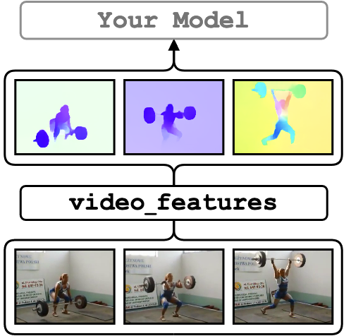

<figure>
  
</figure>

`video_features` allows you to extract features from raw videos in parallel with multiple GPUs.
It supports several extractors that capture visual appearance, optical flow, and audio features.

## Quick Start

[](https://colab.research.google.com/drive/1csJgkVQ3E2qOyVlcOM-ACHGgPBBKwE2Y?usp=sharing)


```bash
# clone the repo and change the working directory
git clone https://github.com/v-iashin/video_features.git
cd video_features

# install environment
conda env create -f conda_env_torch_zoo.yml

# load the environment
conda activate torch_zoo

# extract r(2+1)d features for the sample videos
python main.py \
    feature_type=r21d \
    device_ids="[0]" \
    video_paths="[./sample/v_ZNVhz7ctTq0.mp4, ./sample/v_GGSY1Qvo990.mp4]"

# use `device_ids="[0, 2]"` to run on 0th and 2nd devices in parallel
```

# Supported Models

Action Recognition

- [I3D-Net RGB + Flow (Kinetics 400)](https://v-iashin.github.io/video_features/models/i3d)
- [R(2+1)d RGB (IG-65M, Kinetics 400)](https://v-iashin.github.io/video_features/models/r21d)

Sound Recognition

- [VGGish (AudioSet)](https://v-iashin.github.io/video_features/models/vggish)

Optical Flow

- [RAFT (FlyingChairs, FlyingThings3D, Sintel, KITTI)](https://v-iashin.github.io/video_features/models/raft)
- [PWC-Net (Sintel)](https://v-iashin.github.io/video_features/models/pwc/)

Image Recognition

- [ResNet-18,34,50,101,152 (ImageNet)](https://v-iashin.github.io/video_features/models/resnet)
