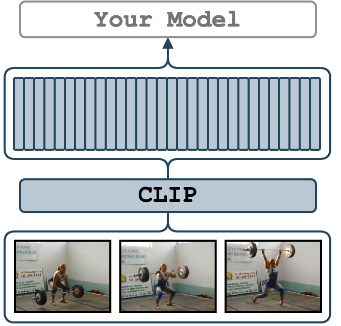

# CLIP

<figure>
  
</figure>

The [CLIP](https://arxiv.org/abs/2103.00020) features are extracted at each frame of the provided video.
CLIP (Contrastive Language-Image Pre-Training) is a neural network trained on a variety of (image, text) pairs.
We use CLIP's official augmentations and extract vision features from its image encoder.
The implementation uses the [OpenAI CLIP](https://github.com/openai/CLIP).
The extracted features are going to be of size `num_frames x 512`.
We additionally output timesteps in ms for each feature and fps of the video.

---

## Set up the Environment for CLIP
Setup `conda` environment. Requirements are in file `conda_env_torch_zoo.yml`
```bash
# it will create a new conda environment called 'torch_zoo' on your machine
conda env create -f conda_env_torch_zoo.yml
```

---

## Quick Start

[](https://colab.research.google.com/drive/1Zd7r8uKGLGSxlil4PPnXk_4I3KOsjPpO?usp=sharing)


Activate the environment
```bash
conda activate torch_zoo
```

and extract features at 1 fps from `./sample/v_GGSY1Qvo990.mp4` video and output results.
```bash
python main.py \
    feature_type="clip" \
    model_name="ViT-B/32" \
    extraction_fps=1 \
    video_paths="[./sample/v_GGSY1Qvo990.mp4]" \
    on_extraction="print"
```

---

## Supported Arguments

<!-- the <div> makes columns wider -->
| <div style="width: 12em">Argument</div> | <div style="width: 8em">Default</div> | Description                                                                                                                                                                                                                     |
| --------------------------------------- | ------------------------------------- | ------------------------------------------------------------------------------------------------------------------------------------------------------------------------------------------------------------------------------- |
| `model_name`                            | `"ViT-B/32"`                          | A variant of CLIP. `"ViT-B/16"`, `"RN50x16"`, `"RN50x4"`, `"RN101"`, `"RN50"`, and `"custom"` are supported.                                                                                                                    |
| `batch_size`                            | `1`                                   | You may speed up extraction of features by increasing the batch size as much as your GPU permits.                                                                                                                               |
| `extraction_fps`                        | `null`                                | If specified (e.g. as `5`), the video will be re-encoded to the `extraction_fps` fps. Leave unspecified or `null` to skip re-encoding.                                                                                          |
| `device`                                | `"cuda:0"`                            | The device specification. It follows the PyTorch style. Use `"cuda:3"` for the 4th GPU on the machine or `"cpu"` for CPU-only.                                                                                                  |
| `video_paths`                           | `null`                                | A list of videos for feature extraction. E.g. `"[./sample/v_ZNVhz7ctTq0.mp4, ./sample/v_GGSY1Qvo990.mp4]"` or just one path `"./sample/v_GGSY1Qvo990.mp4"`.                                                                     |
| `file_with_video_paths`                 | `null`                                | A path to a text file with video paths (one path per line). Hint: given a folder `./dataset` with `.mp4` files one could use: `find ./dataset -name "*mp4" > ./video_paths.txt`.                                                |
| `on_extraction`                         | `print`                               | If `print`, the features are printed to the terminal. If `save_numpy` or `save_pickle`, the features are saved to either `.npy` file or `.pkl`.                                                                                 |
| `output_path`                           | `"./output"`                          | A path to a folder for storing the extracted features (if `on_extraction` is either `save_numpy` or `save_pickle`).                                                                                                             |
| `keep_tmp_files`                        | `false`                               | If `true`, the reencoded videos will be kept in `tmp_path`.                                                                                                                                                                     |
| `tmp_path`                              | `"./tmp"`                             | A path to a folder for storing temporal files (e.g. reencoded videos).                                                                                                                                                          |
| `show_pred`                             | `false`                               | If `true`, the script will print the predictions of the model on a down-stream task. It is useful for debugging.                                                                                                                |
| `pred_texts`                            | `null`                                | If `show_pred=true`, the texts specified in `pred_texts` are used for zero-shot classification (e.g. `pred_texts="['a dog smiles', 'a woman is lifting']"`). If `pred_texts` is unspecified, Kinetics 400 classes will be used. |

---

## Examples
Start by activating the environment
```bash
conda activate torch_zoo
```

It is pretty much the same procedure as with other features.
Here we take `ViT/B-32` as an example, but we also support `ViT-B/16`, `RN50x16`, `RN50x4`, `RN101`, `RN50`
and others in [OpenAI CLIP implementation](https://github.com/openai/CLIP).
In addition, if you want to use your weights, you need to copy your weights to
`models/clip/checkpoints`, rename it `CLIP-custom.pth` and specify `model_name=custom`.
```bash
python main.py \
    feature_type="clip" \
    model_name="ViT-B/32" \
    device="cuda:0" \
    video_paths="[./sample/v_ZNVhz7ctTq0.mp4, ./sample/v_GGSY1Qvo990.mp4]"
```
If you would like to save the features, use `--on_extraction save_numpy` (or `save_pickle`) – by default, the features are saved in `./output/` or where `--output_path` specifies.
In the case of frame-wise features, besides features, it also saves timestamps in ms
and the original fps of the video into the same folder with features.
```bash
python main.py \
    feature_type="clip" \
    model_name="ViT-B/32" \
    device="cuda:0" \
    on_extraction=save_numpy \
    file_with_video_paths=./sample/sample_video_paths.txt
```
We may increase the extraction speed with batching. Therefore, frame-wise features have `--batch_size` argument, which defaults to `1`.
```bash
python main.py \
    feature_type="clip" \
    model_name="ViT-B/32" \
    device="cuda:0" \
    batch_size=128 \
    video_paths="[./sample/v_ZNVhz7ctTq0.mp4, ./sample/v_GGSY1Qvo990.mp4]"
```
If you would like to extract features at a certain fps, add `--extraction_fps` argument
```bash
python main.py \
    feature_type="clip" \
    model_name="ViT-B/32" \
    device="cuda:0" \
    extraction_fps=5 \
    video_paths="[./sample/v_ZNVhz7ctTq0.mp4, ./sample/v_GGSY1Qvo990.mp4]"
```

If you would like to verify the extracted features, you can
set `show_pred="true"` and provide several sentences with `pred_texts` argument.
The value of `pred_texts` should be a list of strings.
The probability that each frame corresponds to all the sentences you provide will be output.
```bash
python main.py \
    feature_type="clip" \
    model_name="ViT-B/32" \
    device="cuda:0" \
    extraction_fps=1 \
    show_pred="true" \
    pred_texts="['a dog smiles', 'a woman is lifting']" \
    video_paths="[./sample/v_ZNVhz7ctTq0.mp4, ./sample/v_GGSY1Qvo990.mp4]"
```
You will get the output for each frame like:
```
  Logits | Prob. | Label
  23.061 | 0.962 | a dog smiles
  19.824 | 0.038 | a woman is lifting

  Logits | Prob. | Label
  22.770 | 0.963 | a dog smiles
  19.520 | 0.037 | a woman is lifting

  Logits | Prob. | Label
  24.619 | 0.929 | a dog smiles
  22.048 | 0.071 | a woman is lifting
...

  Logits | Prob. | Label
  30.966 | 1.000 | a woman is lifting
  15.272 | 0.000 | a dog smiles

  Logits | Prob. | Label
  32.671 | 1.000 | a woman is lifting
  15.413 | 0.000 | a dog smiles

  Logits | Prob. | Label
  32.555 | 1.000 | a woman is lifting
  16.151 | 0.000 | a dog smiles
...
```

You may also leave `pred_texts` unspecified or `null` (None) if you wish to apply CLIP for zero-shot prediction
on Kinetics 400.

---

## Credits
1. The [OpenAI CLIP implementation](https://github.com/openai/CLIP).
2. The [CLIP paper](https://arxiv.org/abs/2103.00020)
3. Thanks to [@Kamino666](https://github.com/Kamino666) who adapted this model for `video_features`

---

## License
The OpenAI CLIP implementation code is under MIT.
