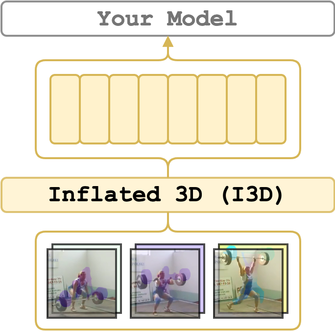

# I3D (RGB + Flow)
<figure>
  
</figure>

The _Inflated 3D ([I3D](https://arxiv.org/abs/1705.07750))_ features are extracted using
a pre-trained model on [Kinetics 400](https://deepmind.com/research/open-source/kinetics).
Here, the features are extracted from the second-to-the-last layer of I3D, before summing them up.
Therefore, it outputs two tensors with 1024-d features: for RGB and flow streams.
By default, it expects to input 64 RGB and flow frames (`224x224`) which spans 2.56 seconds of the video recorded at 25 fps.
In the default case, the features will be of size `Tv x 1024` where `Tv = duration / 2.56`.

Please note, this implementation uses either [PWC-Net](https://arxiv.org/abs/1709.02371) (the default)
and [RAFT](https://arxiv.org/abs/2003.12039) optical flow extraction instead of the TV-L1 algorithm,
which was used in the original I3D paper as it hampers speed.
Yet, it might possibly lead to worse peformance. Our tests show that the performance is reasonable.
You may test it yourself by providing `--show_pred` flag.

!!! warning "CUDA 11 and GPUs like RTX 3090 and newer"

    PWC optical flow back-end is not supported on CUDA 11 and, therefore, GPUs like **RTX 3090** and newer.
    RGB-only model should still work.
    For details please check this [issue #13](https://github.com/v-iashin/video_features/issues/13)
    If you were able to fix it, please share your workaround.
    Feel free to use `flow_type=raft` [RAFT](raft.md) during extraction.

!!! warning "The PWC-Net does NOT support using CPU currently"

    The PWC-Net uses `cupy` module, which makes it difficult to turn to a version that does not use the GPU.
    However, if you have solution, you may submit a PR.

---
## Supported Arguments

<!-- the <div> makes columns wider -->
| <div style="width: 12em">Argument</div> | <div style="width: 8em">Default</div> | Description                                                                                                                                                                      |
| --------------------------------------- | ------------------------------------- | -------------------------------------------------------------------------------------------------------------------------------------------------------------------------------- |
| `stack_size`                            | `64`                                  | The number of frames from which to extract features (or window size).                                                                                                            |
| `step_size`                             | `64`                                  | The number of frames to step before extracting the next features.                                                                                                                |
| `streams`                               | `null`                                | I3D is a two-stream network. By default (`null` or omitted) both RGB and flow streams are used. To use RGB- or flow-only models use `rgb` or `flow`.                             |
| `flow_type`                             | `pwc`                                 | By default, the flow-features of I3D will be calculated using optical from calculated with PWCNet (originally with TV-L1). Another supported model is `raft`.                    |
| `extraction_fps`                        | `null`                                | If specified (e.g. as `5`), the video will be re-encoded to the `extraction_fps` fps. Leave unspecified or `null` to skip re-encoding.                                           |
| `device`                                | `"cuda:0"`                            | The device specification. It follows the PyTorch style. Use `"cuda:3"` for the 4th GPU on the machine or `"cpu"` for CPU-only.                                                   |
| `video_paths`                           | `null`                                | A list of videos for feature extraction. E.g. `"[./sample/v_ZNVhz7ctTq0.mp4, ./sample/v_GGSY1Qvo990.mp4]"` or just one path `"./sample/v_GGSY1Qvo990.mp4"`.                      |
| `file_with_video_paths`                 | `null`                                | A path to a text file with video paths (one path per line). Hint: given a folder `./dataset` with `.mp4` files one could use: `find ./dataset -name "*mp4" > ./video_paths.txt`. |
| `on_extraction`                         | `print`                               | If `print`, the features are printed to the terminal. If `save_numpy` or `save_pickle`, the features are saved to either `.npy` file or `.pkl`.                                  |
| `output_path`                           | `"./output"`                          | A path to a folder for storing the extracted features (if `on_extraction` is either `save_numpy` or `save_pickle`).                                                              |
| `keep_tmp_files`                        | `false`                               | If `true`, the reencoded videos will be kept in `tmp_path`.                                                                                                                      |
| `tmp_path`                              | `"./tmp"`                             | A path to a folder for storing temporal files (e.g. reencoded videos).                                                                                                           |
| `show_pred`                             | `false`                               | If `true`, the script will print the predictions of the model on a down-stream task. It is useful for debugging.                                                                 |

---

## Set up the Environment for I3D
Depending on whether you would like to use PWC-Net or RAFT for optical flow extraction,
you will need to install separate conda environments – `conda_env_pwc.yml` and `conda_env_torch_zoo`, respectively

```bash
# it will create a new conda environment called 'pwc' on your machine
conda env create -f conda_env_pwc.yml
# or/and if you would like to extract optical flow with RAFT
conda env create -f conda_env_torch_zoo.yml
```

---

## Quick Start

[](https://colab.research.google.com/drive/1LKoytZmNxtC-EuCp7pHDM6sFvK1XdwlW?usp=sharing)

Activate the environment
```bash
conda activate pwc
```
if you would like to use RAFT as optical flow extractor use `torch_zoo` instead of `pwc`:

and extract features from `./sample/v_ZNVhz7ctTq0.mp4` video and show the predicted classes
```bash
python main.py \
    feature_type=i3d \
    device="cuda:0" \
    video_paths="[./sample/v_ZNVhz7ctTq0.mp4]" \
    show_pred=true
```

---

## Examples
Activate the environment
```bash
conda activate pwc
```

The following will extract I3D features for sample videos.
The features are going to be extracted with the default parameters.
```bash
python main.py \
    feature_type=i3d \
    device="cuda:0" \
    video_paths="[./sample/v_ZNVhz7ctTq0.mp4, ./sample/v_GGSY1Qvo990.mp4]"
```

The video paths can be specified as a `.txt` file with paths
```bash
python main.py \
    feature_type=i3d \
    device="cuda:0" \
    file_with_video_paths=./sample/sample_video_paths.txt
```
It is also possible to extract features from either `rgb` or `flow` modalities individually (`--streams`)
and, therefore, increasing the speed
```bash
python main.py \
    feature_type=i3d \
    streams=flow \
    device="cuda:0" \
    file_with_video_paths=./sample/sample_video_paths.txt
```

To extract optical flow frames using RAFT approach, specify `--flow_type raft`.
Note that using RAFT will make the extraction slower than with PWC-Net yet visual inspection of extracted flow
frames suggests that RAFT has a better quality of the estimated flow

```bash
# make sure to activate the correct environment (`torch_zoo`)
# conda activate torch_zoo
python main.py \
    feature_type=i3d \
    flow_type=raft \
    device="cuda:0" \
    file_with_video_paths=./sample/sample_video_paths.txt
```

The features can be saved as numpy arrays by specifying `--on_extraction save_numpy` or `save_pickle`.
By default, it will create a folder `./output` and will store features there
```bash
python main.py \
    feature_type=i3d \
    device="cuda:0" \
    on_extraction=save_numpy \
    file_with_video_paths=./sample/sample_video_paths.txt
```
You can change the output folder using `--output_path` argument.

Also, you may want to try to change I3D window and step sizes
```bash
python main.py \
    feature_type=i3d \
    device="cuda:0" \
    stack_size=24 \
    step_size=24 \
    file_with_video_paths=./sample/sample_video_paths.txt
```

By default, the frames are extracted according to the original fps of a video. If you would like to extract frames at a certain fps, specify `--extraction_fps` argument.
```bash
python main.py \
    feature_type=i3d \
    device="cuda:0" \
    extraction_fps=25 \
    stack_size=24 \
    step_size=24 \
    file_with_video_paths=./sample/sample_video_paths.txt
```
A fun note, the time span of the I3D features in the last example will match the time span of VGGish features
with default parameters (24/25 = 0.96).

If `--keep_tmp_files` is specified, it keeps them in `--tmp_path` which is `./tmp` by default.
Be careful with the `--keep_tmp_files` argument when playing with `--extraction_fps` as it may mess up the
frames you extracted before in the same folder.

---

## Credits
1. [An implementation of PWC-Net in PyTorch](https://github.com/sniklaus/pytorch-pwc/tree/f6138900578214ab4e3daef6743b88f7824293be)
2. The [Official RAFT implementation (esp. `./demo.py`)](https://github.com/princeton-vl/RAFT/tree/25eb2ac723c36865c636c9d1f497af8023981868).
3. [A port of I3D weights from TensorFlow to PyTorch](https://github.com/hassony2/kinetics_i3d_pytorch)
4. The I3D paper: [Quo Vadis, Action Recognition? A New Model and the Kinetics Dataset](https://arxiv.org/abs/1705.07750).

---

## License
The wrapping code is MIT and the port of I3D weights from TensorFlow to PyTorch. However, PWC Net (default flow extractor) has [GPL-3.0](https://github.com/sniklaus/pytorch-pwc/blob/f6138900578214ab4e3daef6743b88f7824293be/LICENSE) and RAFT [BSD 3-Clause](https://github.com/princeton-vl/RAFT/blob/25eb2ac723c36865c636c9d1f497af8023981868/LICENSE).
