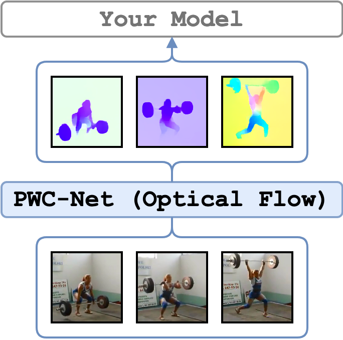

# PWC-Net
<figure>
  
</figure>

[PWC-Net: CNNs for Optical Flow Using Pyramid, Warping, and Cost Volume](https://arxiv.org/abs/1709.02371) frames are extracted for every consecutive pair of frames in a video. PWC-Net is pre-trained on [Sintel Flow dataset](http://sintel.is.tue.mpg.de/). The implementation follows [sniklaus/pytorch-pwc@f61389005](https://github.com/sniklaus/pytorch-pwc/tree/f6138900578214ab4e3daef6743b88f7824293be).

!!! warning "CUDA 11 and GPUs like RTX 3090 and newer"

    The current environment does not support **CUDA 11** and, therefore, GPUs like **RTX 3090** and newer.
    For details please check this [issue #13](https://github.com/v-iashin/video_features/issues/13)
    If you were able to fix it, please share your workaround.
    If you need an optical flow extractor, you are recommended to use [RAFT](raft.md).

---

## Set up the Environment for PWC
Setup `conda` environment.
```bash
# it will create a new conda environment called 'pwc' on your machine
conda env create -f conda_env_pwc.yml
```

---

## Minimal Working Example

Activate the environment
```bash
conda activate pwc
```

and extract optical flow from `./sample/v_GGSY1Qvo990.mp4` using one GPU and show the flow for each frame
```bash
python main.py \
    feature_type=pwc \
    show_pred=true \
    video_paths="[./sample/v_GGSY1Qvo990.mp4]"
```
*Note*, if `show_pred=true`, the window with predictions will appear, use any key to show the next frame.
To use `show_pred=true`, a screen must be attached to the machine or X11 forwarding is enabled.

---

## Examples
Please see the examples for [`RAFT`](raft.md) optical flow frame extraction. Make sure to replace `--feature_type` argument to `pwc`.

---

## Credits
1. The [PWC-Net paper](https://arxiv.org/abs/1709.02371) and [official implementation](https://github.com/NVlabs/PWC-Net).
2. The [PyTorch implementation used in this repo](https://github.com/sniklaus/pytorch-pwc/tree/f6138900578214ab4e3daef6743b88f7824293be).

---

## License
The wrapping code is under MIT, but PWC Net has [GPL-3.0](https://github.com/sniklaus/pytorch-pwc/blob/f6138900578214ab4e3daef6743b88f7824293be/LICENSE)
