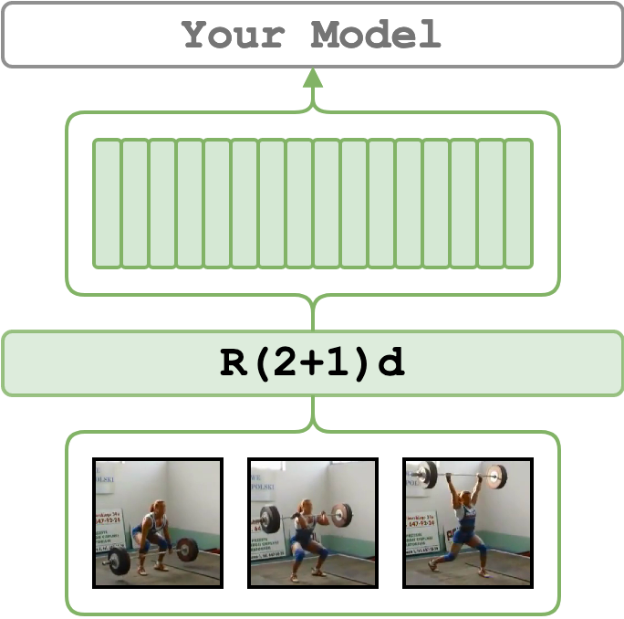

# R(2+1)D (RGB-only)

<figure>
  
</figure>

We support 3 flavors of R(2+1)D:

- `r2plus1d_18_16_kinetics` 18-layer R(2+1)D pre-trained on [Kinetics 400](https://deepmind.com/research/open-source/kinetics)
(used by default) – it is identical to the
[torchvision implementation](https://pytorch.org/vision/0.12/models.html#video-classification)
- `r2plus1d_34_32_ig65m_ft_kinetics` 34-layer R(2+1)D pre-trained on [IG-65M](https://arxiv.org/abs/1905.00561)
and fine-tuned on Kinetics 400 – the weights are provided by
[moabitcoin/ig65m-pytorch](https://github.com/moabitcoin/ig65m-pytorch)
repo for stack/step size `32`.
- `r2plus1d_34_8_ig65m_ft_kinetics` the same as the one above but this one was pre-trained with stack/step size `8`


models are pre-trained on RGB frames and follow the plain
[torchvision augmentation sequence](https://github.com/pytorch/vision/blob/1aef87d01eec2c0989458387fa04baebcc86ea7b/references/video_classification/train.py#L154-L159).

!!! info
    The flavors that were pre-trained on IG-65M and fine-tuned on Kinetics 400 yield
    significantly better performance than the default model
    (e.g. the `32` frame model reaches an accuracy of 79.10 vs 57.50 by default).

By default (`--model_name=r2plus1d_18_16_kinetics`), the model expects to input a stack of 16 RGB frames (`112x112`),
which spans 0.64 seconds of the video recorded at 25 fps.
In the default case, the features will be of size `Tv x 512` where `Tv = duration / 0.64`.
Specify, `model_name`, `--step_size` and `--stack_size` to change the default behavior.


---

## Set up the Environment for R(2+1)D
Setup `conda` environment. Requirements are in file `conda_env_torch_zoo.yml`
```bash
# it will create a new conda environment called 'torch_zoo' on your machine
conda env create -f conda_env_torch_zoo.yml
```

---

## Minimal Working Example

[](https://colab.research.google.com/drive/1csJgkVQ3E2qOyVlcOM-ACHGgPBBKwE2Y?usp=sharing)

Activate the environment
```bash
conda activate torch_zoo
```

and extract features from the `./sample/v_GGSY1Qvo990.mp4` video and show the predicted classes
```bash
python main.py \
    feature_type=r21d \
    video_paths="[./sample/v_GGSY1Qvo990.mp4]" \
    show_pred=true
```

---

## Example
Start by activating the environment
```bash
conda activate torch_zoo
```

It will extract R(2+1)d features for sample videos using 0th and 2nd devices in parallel. The features are going to be extracted with the default parameters.
```bash
python main.py \
    feature_type=r21d \
    device_ids="[0, 2]" \
    video_paths="[./sample/v_ZNVhz7ctTq0.mp4, ./sample/v_GGSY1Qvo990.mp4]"
```
See [I3D Examples](i3d.md). Note, that this implementation of R(2+1)d only supports the RGB stream.

---

## Credits
1. The [TorchVision implementation](https://pytorch.org/vision/0.12/models.html#video-classification).
2. The R(2+1)D paper: [A Closer Look at Spatiotemporal Convolutions for Action Recognition](https://arxiv.org/abs/1711.11248).
3. Thanks to [@ohjho](https://github.com/ohjho) we now also support the favors of the 34-layer model pre-trained
on [IG-65M](https://arxiv.org/abs/1905.00561) and fine-tuned on [Kinetics 400](https://deepmind.com/research/open-source/kinetics).
  * A shout-out to devs of [moabitcoin/ig65m-pytorch](https://github.com/moabitcoin/ig65m-pytorch) who adapted weights of these favors from Caffe to PyTorch.
  * The paper where these flavors were presented:
   [Large-scale weakly-supervised pre-training for video action recognition](https://arxiv.org/abs/1905.00561)

---

## License
The wrapping code is under MIT, yet, it utilizes `torchvision` library which is under [BSD 3-Clause "New" or "Revised" License](https://github.com/pytorch/vision/blob/master/LICENSE).
