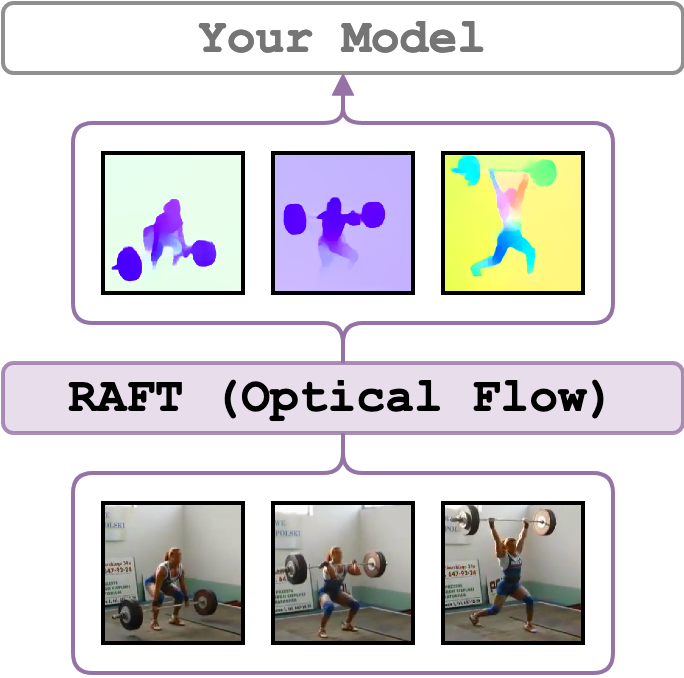

# RAFT
<figure>
  
</figure>

[Recurrent All-Pairs Field Transforms for Optical Flow (RAFT)](https://arxiv.org/abs/2003.12039) frames are extracted for every
consecutive pair of frames in a video.
The implementation follows the [official implementation](https://github.com/princeton-vl/RAFT/tree/25eb2ac723c36865c636c9d1f497af8023981868).
RAFT is pre-trained on [FlyingChairs](https://lmb.informatik.uni-freiburg.de/resources/datasets/FlyingChairs.en.html),
fine-tuned on [FlyingThings3D](https://lmb.informatik.uni-freiburg.de/resources/datasets/SceneFlowDatasets.en.html), then it is finetuned
on [Sintel](http://sintel.is.tue.mpg.de/) or [KITTI-2015](http://www.cvlibs.net/datasets/kitti/eval_scene_flow.php?benchmark=flow)
(see the Training Schedule in the Experiments section in the RAFT paper).
Also, check out and [this issue](https://github.com/princeton-vl/RAFT/issues/37) to learn more about the shared models.

The optical flow frames have the same size as the video input or as specified by the resize arguments. We additionally output timesteps in ms for each feature and fps of the video.

---

## Set up the Environment for RAFT
Setup `conda` environment. Requirements for RAFT are similar to the torchvision zoo, which uses `conda_env_torch_zoo.yml`
```bash
# it will create a new conda environment called 'torch_zoo' on your machine
conda env create -f conda_env_torch_zoo.yml
```

---

## Minimal Working Example

[](https://colab.research.google.com/drive/18I95Rn1B3a2ISfD9b-o4o93m3XuHbcIY?usp=sharing)

Activate the environment
```bash
conda activate torch_zoo
```

and extract optical flow from `./sample/v_GGSY1Qvo990.mp4` using one GPU and show the flow for each frame
```bash
python main.py \
    feature_type=raft \
    show_pred=true \
    video_paths="[./sample/v_GGSY1Qvo990.mp4]"
```
*Note*, if `show_pred=true`, the window with predictions will appear, use any key to show the next frame.
To use `show_pred=true`, a screen must be attached to the machine or X11 forwarding is enabled.

---

## Examples

Start by activating the environment
```bash
conda activate torch_zoo
```

A minimal working example:
it will extract RAFT optical flow frames for sample videos using 0th and 2nd devices in parallel.
```bash
python main.py \
    feature_type=raft \
    device_ids="[0, 2]" \
    video_paths="[./sample/v_ZNVhz7ctTq0.mp4, ./sample/v_GGSY1Qvo990.mp4]"
```
Note, if your videos are quite long, have large dimensions and fps, watch your RAM as the frames are stored in the memory until they are saved. Please see other examples how can you overcome this problem.

By default, the frames are extracted using the Sintel model. If you wish you can use KITTI-pretrained model by changing the `finetuned_on` argument:
```bash
python main.py \
    feature_type=raft \
    device_ids="[0, 2]" \
    finetuned_on=kitti \
    video_paths="[./sample/v_ZNVhz7ctTq0.mp4, ./sample/v_GGSY1Qvo990.mp4]"
```

If you would like to save the frames, use `--on_extraction save_numpy` (or `save_pickle`) – by default, the frames are saved in `./output/` or where `--output_path` specifies. In the case of RAFT, besides frames, it also saves timestamps in ms and the original fps of the video into the same folder with features.
```bash
python main.py \
    feature_type=raft \
    device_ids="[0, 2]" \
    on_extraction=save_numpy \
    video_paths="[./sample/v_ZNVhz7ctTq0.mp4, ./sample/v_GGSY1Qvo990.mp4]"
```
Since extracting flow between two frames is cheap we may increase the extraction speed with batching. Therefore, you can use `--batch_size` argument (defaults to `1`) to do so. _A precaution: make sure to properly test the memory impact of using a specific batch size if you are not sure which kind of videos you have. For instance, you tested the extraction on 16:9 aspect ratio videos but some videos are 16:10 which might give you a mem error. Therefore, I would recommend to tune `--batch_size` on a square video and using the resize arguments (showed later)_
```bash
python main.py \
    feature_type=raft \
    device_ids="[0, 2]" \
    batch_size=16 \
    video_paths="[./sample/v_ZNVhz7ctTq0.mp4, ./sample/v_GGSY1Qvo990.mp4]"
```
Another way of speeding up the extraction is to resize the input frames.
Use `resize_to_smaller_edge=true` (default) if you would like `--side_size` to be `min(W, H)`
if `resize_to_smaller_edge=false` the `--side_size` value will correspond to be `max(W, H)` .
The latter might be useful when you are not sure which aspect ratio the videos have (the upper bound on size).
```bash
python main.py \
    feature_type=raft \
    device_ids="[0, 2]" \
    side_size=256 \
    resize_to_smaller_edge=false \
    video_paths="[./sample/v_ZNVhz7ctTq0.mp4, ./sample/v_GGSY1Qvo990.mp4]"
```
If the videos have different fps rate, `--extraction_fps` might be used to specify the target fps of all videos (a video is reencoded and saved to `--tmp_path` folder and deleted if `--keep_tmp_files` wasn't used).
```bash
python main.py \
    feature_type=raft \
    device_ids="[0, 2]" \
    extraction_fps=1 \
    video_paths="[./sample/v_ZNVhz7ctTq0.mp4, ./sample/v_GGSY1Qvo990.mp4]"
```

---

## Credits
1. The [Official RAFT implementation (esp. `./demo.py`)](https://github.com/princeton-vl/RAFT/tree/25eb2ac723c36865c636c9d1f497af8023981868).
2. The RAFT paper: [RAFT: Recurrent All Pairs Field Transforms for Optical Flow](https://arxiv.org/abs/2003.12039).

---

## License
The wrapping code is under MIT, but the RAFT implementation complies with [BSD 3-Clause](https://github.com/princeton-vl/RAFT/blob/25eb2ac723c36865c636c9d1f497af8023981868/LICENSE).
