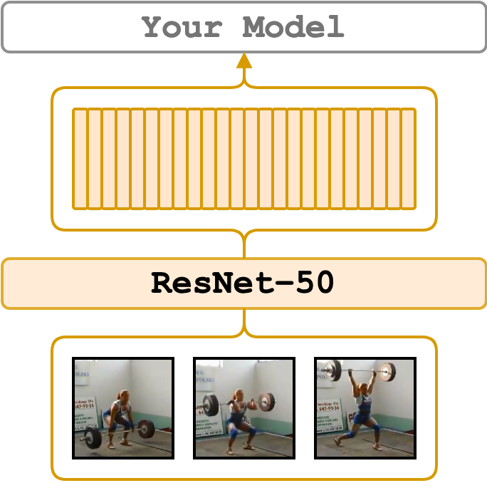

# ResNet

<figure>
  
</figure>

The [ResNet](https://arxiv.org/abs/1512.03385) features are extracted at each frame of the provided video.
The ResNet is pre-trained on the 1k ImageNet dataset.
We extract features from the pre-classification layer.
The implementation is based on the [torchvision models](https://pytorch.org/docs/1.6.0/torchvision/models.html#classification).
The extracted features are going to be of size `num_frames x 2048`.
We additionally output timesteps in ms for each feature and fps of the video. We use the standard set of augmentations.

---

## Set up the Environment for ResNet
Setup `conda` environment. Requirements are in file `conda_env_torch_zoo.yml`
```bash
# it will create a new conda environment called 'torch_zoo' on your machine
conda env create -f conda_env_torch_zoo.yml
```

---

## Minimal Working Example

[](https://colab.research.google.com/drive/17VLdf4abQT2eoMjc6ziJ9UaRaOklTlP0?usp=sharing)

Activate the environment
```bash
conda activate torch_zoo
```

and extract features at 1 fps from `./sample/v_GGSY1Qvo990.mp4` video and show the predicted classes
```bash
python main.py \
    feature_type=resnet101 \
    extraction_fps=1 \
    video_paths="[./sample/v_GGSY1Qvo990.mp4]" \
    show_pred=true
```

---

## Examples
Start by activating the environment
```bash
conda activate torch_zoo
```

It is pretty much the same procedure as with other features. The example is provided for the ResNet-50 flavour, but we also support ResNet-18,34,101,152.
```bash
python main.py \
    feature_type=resnet50 \
    device_ids="[0, 2]" \
    video_paths="[./sample/v_ZNVhz7ctTq0.mp4, ./sample/v_GGSY1Qvo990.mp4]"
```
If you would like to save the features, use `--on_extraction save_numpy` (or `save_pickle`) – by default, the features are saved in `./output/` or where `--output_path` specifies. In the case of frame-wise features, besides features, it also saves timestamps in ms and the original fps of the video into the same folder with features.
```bash
python main.py \
    feature_type=resnet50 \
    device_ids="[0, 2]" \
    on_extraction=save_numpy \
    file_with_video_paths=./sample/sample_video_paths.txt
```
Since these features are so fine-grained and light-weight we may increase the extraction speed with batching. Therefore, frame-wise features have `--batch_size` argument, which defaults to `1`.
```bash
python main.py \
    feature_type=resnet50 \
    device_ids="[0, 2]" \
    batch_size=128 \
    video_paths="[./sample/v_ZNVhz7ctTq0.mp4, ./sample/v_GGSY1Qvo990.mp4]"
```
If you would like to extract features at a certain fps, add `--extraction_fps` argument
```bash
python main.py \
    feature_type=resnet50 \
    device_ids="[0, 2]" \
    extraction_fps=5 \
    video_paths="[./sample/v_ZNVhz7ctTq0.mp4, ./sample/v_GGSY1Qvo990.mp4]"
```

---

## Credits
1. The [TorchVision implementation](https://pytorch.org/docs/1.6.0/torchvision/models.html#classification).
2. The [ResNet paper](https://arxiv.org/abs/1512.03385)

---

## License
The wrapping code is under MIT, yet, it utilizes `torchvision` library which is under [BSD 3-Clause "New" or "Revised" License](https://github.com/pytorch/vision/blob/master/LICENSE).
